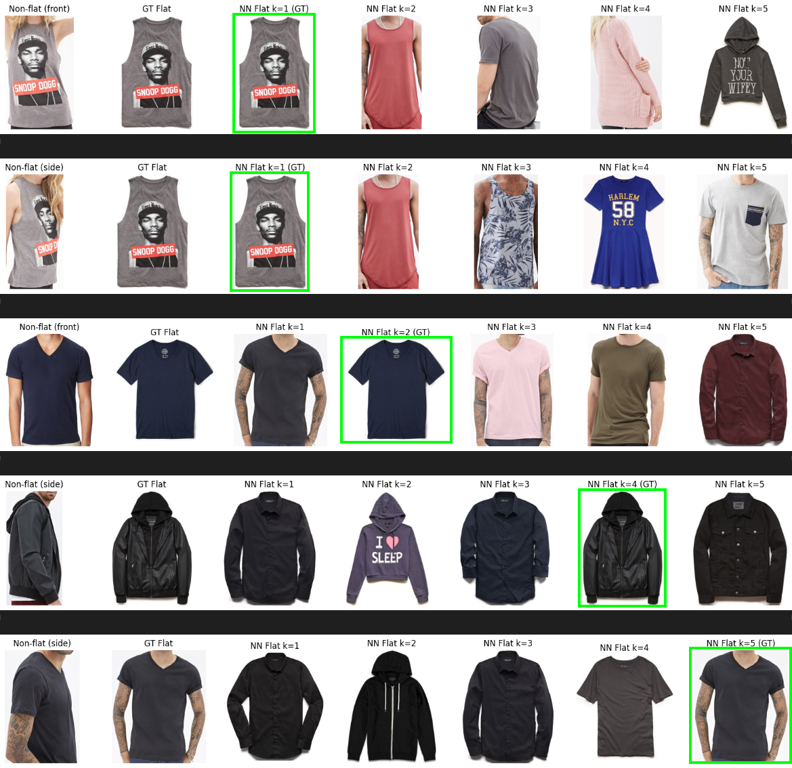

# VisionAndCognitiveSystemsExam

This repository collects the notebooks and the datasets used for the Exam Project of the course Vision and Cognitive Systems.

Here is summarized a brief description of each element in this repository, ordered to better understand what has been done.

To run this code, make sure to clone this repository locally and download the used datasets from kaggle, namely: [DeepFashion Dataset](https://www.kaggle.com/datasets/vishalbsadanand/deepfashion-1), [DeepFashion2 Dataset](https://www.kaggle.com/datasets/thusharanair/deepfashion2-original-with-dataframes), [Fashion Product Images Dataset (full size images)](https://www.kaggle.com/datasets/paramaggarwal/fashion-product-images-dataset), [Cap-dataset](https://www.kaggle.com/datasets/shivanandverma/cap-dataset), [Shoes Dataset](https://www.kaggle.com/datasets/noobyogi0100/shoe-dataset). Please, make sure to save datasets, notebooks and weights in the same directory.

1. **datasets_exploration.ipynb**: Notebook used to understand in first place how the various datasets are organized, which features they collect and what is their distribution. The first two sections are used to investigate the datasets *Apparel Dataset* and *Clothing Dataset*, both from Kaggle, but they have not been used in the project;

2. **Shoes_dataset_annottaions**: Folder collecting the python script used to create the interface to easily manually annotatate the shoes dataset, and the resulted annotations in .json format.

3. **YOLO_detector_capdataset.ipynb**, **YOLO_detector_df2.ipynb**, **YOLO_detector_shoesdataset.ipynb**: Notebooks used to install ultralytics and YOLO, and to train and validate the detectors on the referenced datasets (where df2 stands for *DeepFashion2 Dataset*. The results, including losses, metrics, examples and weights are collected in the folders **YOLO_detector_capdataset**, **YOLO_detector_df2**, **YOLO_detector_shoesdataset**;

4. **df_fp_datasets_preparationForClassifier.ipynb**: Notebooks used to preprocess the *Fashion Product Images* and *DeepFashion* datasets for the classifier: here, data has been cleaned, items detected, features cleaned and merged. Final statistics and train - validation splitting are also included;

5. [Classifier dataset](https://drive.google.com/file/d/1OldmzrcJGpiLtt9oM2yNXNh9PaoWNQSa/view?usp=sharing): link to the folder containing the prepared datasets used to train and validate the Classifier. The huge size of the folder don't let the upload here, make sure of downloading and unzipping its content in the main directory where the repository has been cloned;

6. **Resnet101_selfsup_SimCLR.ipynb**: Training of the backbone for the classifier. The loss curve is saved in the folder *Resnet101_selfsup_SimCLR*, while the final weights for ResNet101 architecture can be found in *model_selfSup_resnet101_hidden512_nogreyAugment.pth*. A visualization of the similarity of item is also included;

7. **Classifier_matcher.ipynb**: Notebook used to train the Classifier and to evaluate the matcher. Some images are displayed to show the retrieved matches using cosine similarity;

8. [Classifier_weightsAndConfusionMatrices](https://drive.google.com/file/d/1A6RhYCJP1ouUB8tJjxOKFP9s80GKf3of/view?usp=sharing): folder containing the final weights for the whole architecture and the confusion matrices computed on the validation set. It has been loaded separately due to its size. 
